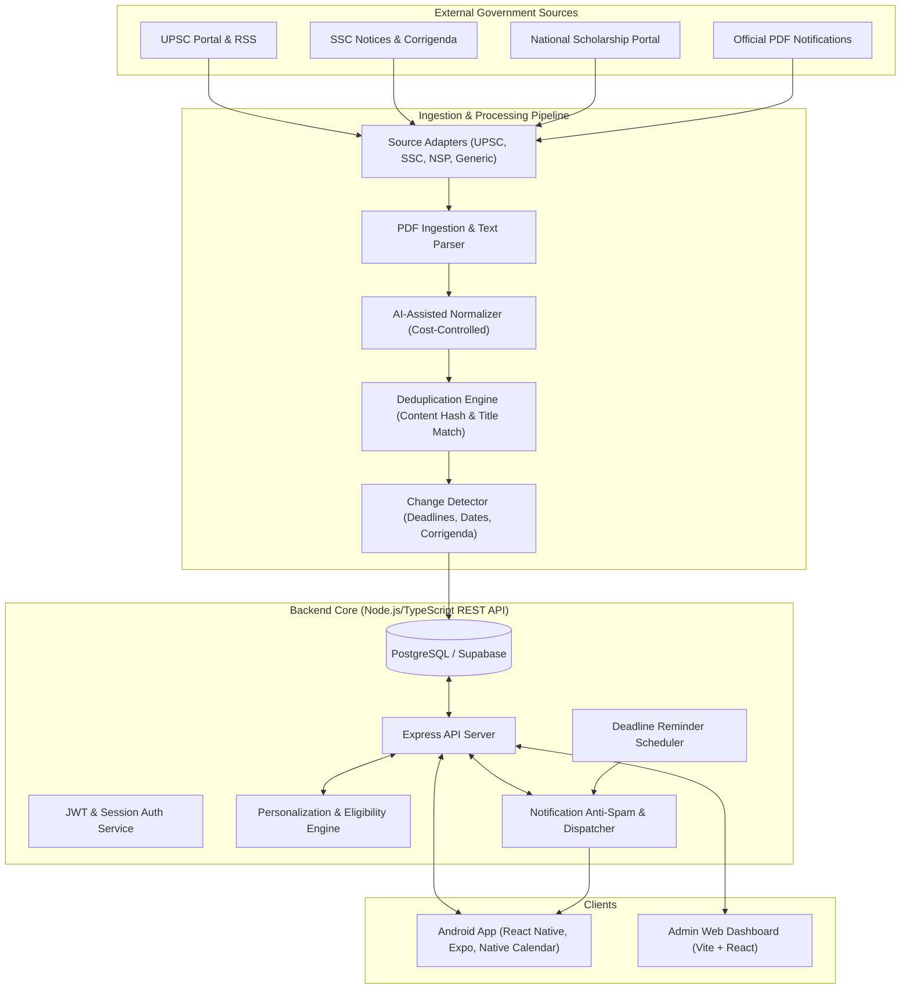

# GovAlert Architecture & System Design Plan

## 1. Executive Overview

**GovAlert** is an enterprise-grade mobile and cloud platform engineered to aggregate, verify, personalize, and notify Indian citizens about public sector opportunities—including government recruitments (UPSC, SSC, State PSC, PSU, Railways, Defense, Banking), national and state scholarships (NSP, AICTE, UGC), research fellowships, competitive exams, and government internships.

The system is architected around the core principle of **"Source Authenticity First"**:
- The platform never fabricates government data or claims official authority.
- The platform calculates "Potentially eligible based on your profile" using transparent, deterministic matching rules.
- Users are seamlessly directed to official notification PDFs and verified government portal application links.

---

## 2. High-Level System Architecture

---

## 3. Technology Stack Decisions

| Component | Technology | Rationale |
| :--- | :--- | :--- |
| **Mobile Client** | React Native 0.74+, Expo SDK 51/52, TypeScript | Industry standard cross-platform framework with first-class Android native compilation, Hermes engine, and zero-config native modules. |
| **Mobile Navigation** | Expo Router (File-based) | Deep linking, typed routes, seamless stack and tab navigation. |
| **Mobile State** | Zustand + AsyncStorage | Lightweight, predictable store without Redux boilerplate; offline cache persistence. |
| **Backend Framework** | Node.js (v20+ LTS) + TypeScript + Express | High throughput asynchronous I/O, rich ecosystem for scrapers, PDF parsers, and cron workers. |
| **Database & ORM** | PostgreSQL + Prisma ORM | Relational integrity, structured JSON fields for eligibility rules, migrations, schema safety. Full compatibility with Supabase. |
| **Document Processing**| `pdf-parse`, regex extractors + Optional Gemini/OpenAI API | Deterministic extraction for primary fields; AI extraction as structured fallback with strict validation. |
| **Scheduler** | `node-cron` & Scheduled Background Workers | Configurable per-source refresh intervals (e.g. 6h, 12h, 24h). |
| **Admin Dashboard** | Vite + React + TailwindCSS | Fast, responsive interface for reviewing extractions, managing sources, and inspecting duplicate candidates. |
| **Android Packaging** | Expo Prebuild + Gradle + Android SDK | Direct generation of release `.apk` installable on physical Android devices. |

---

## 4. Subsystems Breakdown

### A. Mobile Application (`apps/mobile`)
- **Bottom Navigation**: Home, Discover, Saved, Applications Tracker, Profile.
- **Dedicated Flow Screens**: Full Opportunity Detail (`/opportunity/[id]`), Global Search with Debounce (`/search`), Onboarding Wizard (`/onboarding`), Auth (`/auth/login`, `/auth/register`).
- **Native Android Integrations**:
  - `expo-notifications` for scheduled local reminders and push notifications.
  - `expo-calendar` / native intents for syncing deadlines and exam dates to Google Calendar.
  - `expo-web-browser` / `Linking` for in-app or secure browser verification of official URLs.
  - Offline caching for bookmarked opportunities, profile, and recent searches.

### B. Ingestion & Adapter Architecture (`backend/src/ingestion`)
- Unified `SourceAdapter` base class:
  - `fetch()`: Safe HTTP GET with custom User-Agent and retry logic.
  - `parse()`: HTML/RSS/JSON extraction.
  - `normalize()`: Maps source fields to normalized `Opportunity` schema.
  - `validate()`: Rejects opportunities lacking mandatory verified links or dates.
  - `deduplicate()`: Content-hash and fuzzy organization/title matching.
  - `store()`: Persists changes and creates snapshots.

### C. Personalization & Eligibility Engine (`backend/src/services/eligibility.ts`)
- Matches:
  1. **Education Level & Degree**: (e.g., User: B.E. Computer Science vs Opportunity: B.Tech/B.E. in Engineering).
  2. **Branch / Specialization**: Keyword & alias matching (e.g., "Computer Engineering" = "Computer Science" = "IT").
  3. **Age Limits**: User age dynamically calculated from `dateOfBirth` and compared against min/max age rules.
  4. **State / District Preferences**: All-India vs domicile-specific opportunities.
- Output: Non-authoritative, structured matching list with green checks:
  `✓ Engineering degree requirement met`
  `✓ Age (22) within limit (18 - 30)`
  `⚠️ Final eligibility is subject to the official notification.`

### D. Change Detection & Notification Engine (`backend/src/services/change-detector.ts`)
- Preserves every historical snapshot in `opportunity_versions`.
- Generates `source_changes` records when deadlines extend, exam dates are announced, or corrigenda are released.
- Triggers targeted notifications to users who have saved or tracked the opportunity.

### E. Anti-Spam Notification Policy
- Caps daily notifications per user (configurable, default 5/day).
- Enforces user-configurable Quiet Hours (e.g., 10 PM – 7 AM).
- Deduplicates alert broadcasts: users never receive identical alerts for the same un-modified opportunity.
