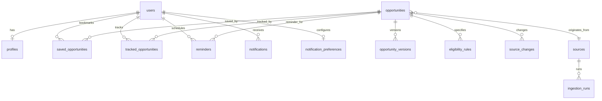

# GovAlert Database Schema Design

GovAlert utilizes **PostgreSQL** (compatible with Supabase or self-hosted PostgreSQL).
All models enforce relational integrity, appropriate cascading behavior, indexes on frequently queried fields, and full audit timestamps.

## Entity-Relationship Overview

---

## Detailed Table Specifications

### 1. `users`
Represents application accounts (email/password or OAuth).
- `id`: UUID (Primary Key, default `gen_random_uuid()`)
- `email`: VARCHAR(255) (UNIQUE, NOT NULL, indexed)
- `password_hash`: VARCHAR(255) (NOT NULL)
- `role`: VARCHAR(32) (NOT NULL, default `'user'`, values: `'user'`, `'admin'`)
- `created_at`: TIMESTAMPTZ (default `NOW()`)
- `updated_at`: TIMESTAMPTZ (default `NOW()`)

### 2. `profiles`
User educational, demographic, and interest details.
- `id`: UUID (Primary Key)
- `user_id`: UUID (FK -> `users.id`, ON DELETE CASCADE, UNIQUE)
- `name`: VARCHAR(255) (NOT NULL)
- `date_of_birth`: DATE (Nullable)
- `state`: VARCHAR(100) (Nullable)
- `district`: VARCHAR(100) (Nullable)
- `education_level`: VARCHAR(100) (Nullable, e.g. `'Undergraduate'`, `'Postgraduate'`)
- `degree`: VARCHAR(255) (Nullable, e.g. `'B.Tech'`, `'B.E.'`, `'B.Sc'`)
- `branch`: VARCHAR(255) (Nullable, e.g. `'Computer Science'`, `'Mechanical'`)
- `college`: VARCHAR(255) (Nullable)
- `graduation_year`: INT (Nullable)
- `cgpa_or_percentage`: NUMERIC(5,2) (Nullable)
- `experience`: VARCHAR(255) (Nullable)
- `skills`: TEXT[] (default `'{}'`)
- `interests`: TEXT[] (default `'{}'`)
- `preferred_locations`: TEXT[] (default `'{}'`)
- `preferred_opportunity_types`: TEXT[] (default `'{}'`)
- `category`: VARCHAR(50) (Nullable, optional demographic category for reservations)
- `created_at`: TIMESTAMPTZ (default `NOW()`)
- `updated_at`: TIMESTAMPTZ (default `NOW()`)

### 3. `sources`
Monitored official government bodies and portals.
- `id`: UUID (Primary Key)
- `name`: VARCHAR(255) (NOT NULL, e.g. `'Union Public Service Commission'`)
- `code`: VARCHAR(64) (UNIQUE, NOT NULL, e.g. `'UPSC'`, `'SSC'`, `'NSP'`)
- `base_url`: VARCHAR(1024) (NOT NULL)
- `adapter_type`: VARCHAR(64) (NOT NULL, e.g. `'UPSCAdapter'`, `'GenericAdapter'`)
- `check_interval_hours`: INT (NOT NULL, default `6`)
- `is_active`: BOOLEAN (NOT NULL, default `true`)
- `last_run_at`: TIMESTAMPTZ (Nullable)
- `last_status`: VARCHAR(32) (default `'IDLE'`)
- `error_message`: TEXT (Nullable)
- `created_at`: TIMESTAMPTZ (default `NOW()`)

### 4. `opportunities`
Core normalized opportunity catalog.
- `id`: UUID (Primary Key)
- `source_id`: UUID (FK -> `sources.id`, ON DELETE SET NULL, Nullable)
- `title`: VARCHAR(500) (NOT NULL, indexed)
- `organization`: VARCHAR(255) (NOT NULL, indexed)
- `category`: VARCHAR(64) (NOT NULL, indexed) - e.g. `'Government Jobs'`, `'Scholarships'`, `'Internships'`, `'Exams'`
- `description`: TEXT (NOT NULL)
- `short_description`: VARCHAR(1000) (Nullable)
- `application_start_date`: TIMESTAMPTZ (Nullable)
- `application_deadline`: TIMESTAMPTZ (Nullable, indexed)
- `exam_date`: TIMESTAMPTZ (Nullable)
- `result_date`: TIMESTAMPTZ (Nullable)
- `location`: VARCHAR(255) (Nullable)
- `work_mode`: VARCHAR(64) (default `'On-site'`)
- `employment_type`: VARCHAR(64) (default `'Full-time'`)
- `vacancy_count`: INT (Nullable)
- `salary_min`: NUMERIC(12,2) (Nullable)
- `salary_max`: NUMERIC(12,2) (Nullable)
- `stipend`: VARCHAR(100) (Nullable)
- `eligibility`: TEXT (Nullable)
- `age_limit_min`: INT (Nullable)
- `age_limit_max`: INT (Nullable)
- `education_requirements`: TEXT[] (default `'{}'`)
- `branch_requirements`: TEXT[] (default `'{}'`)
- `experience_requirements`: VARCHAR(255) (Nullable)
- `category_requirements`: TEXT[] (default `'{}'`)
- `application_fee`: NUMERIC(10,2) (Nullable)
- `official_notification_url`: VARCHAR(1024) (Nullable)
- `official_application_url`: VARCHAR(1024) (Nullable)
- `official_source_url`: VARCHAR(1024) (NOT NULL)
- `source_type`: VARCHAR(64) (default `'Official Portal'`)
- `source_name`: VARCHAR(255) (NOT NULL)
- `status`: VARCHAR(32) (default `'OPEN'`, indexed)
- `deadline_status`: VARCHAR(32) (default `'OPEN'`)
- `is_verified`: BOOLEAN (default `true`)
- `content_hash`: VARCHAR(64) (NOT NULL, indexed)
- `version`: INT (default `1`)
- `is_seed`: BOOLEAN (default `false`)
- `last_verified_at`: TIMESTAMPTZ (default `NOW()`)
- `created_at`: TIMESTAMPTZ (default `NOW()`)
- `updated_at`: TIMESTAMPTZ (default `NOW()`)

### 5. `opportunity_versions`
Historical version snapshots for tracking changes.
- `id`: UUID (Primary Key)
- `opportunity_id`: UUID (FK -> `opportunities.id`, ON DELETE CASCADE)
- `version_number`: INT (NOT NULL)
- `snapshot_data`: JSONB (NOT NULL)
- `changes_summary`: TEXT (Nullable)
- `created_at`: TIMESTAMPTZ (default `NOW()`)

### 6. `saved_opportunities`
User bookmarks.
- `id`: UUID (Primary Key)
- `user_id`: UUID (FK -> `users.id`, ON DELETE CASCADE)
- `opportunity_id`: UUID (FK -> `opportunities.id`, ON DELETE CASCADE)
- `created_at`: TIMESTAMPTZ (default `NOW()`)
- `UNIQUE(user_id, opportunity_id)`

### 7. `tracked_opportunities`
Lightweight application pipeline / kanban tracking.
- `id`: UUID (Primary Key)
- `user_id`: UUID (FK -> `users.id`, ON DELETE CASCADE)
- `opportunity_id`: UUID (FK -> `opportunities.id`, ON DELETE CASCADE)
- `status`: VARCHAR(50) (NOT NULL, default `'Interested'`)
  - Values: `Interested`, `Saved`, `Planning to Apply`, `Applied`, `Exam Scheduled`, `Interview`, `Selected`, `Rejected`, `Closed`
- `notes`: TEXT (Nullable)
- `created_at`: TIMESTAMPTZ (default `NOW()`)
- `updated_at`: TIMESTAMPTZ (default `NOW()`)
- `UNIQUE(user_id, opportunity_id)`

### 8. `reminders`
Configurable deadline and exam date alerts.
- `id`: UUID (Primary Key)
- `user_id`: UUID (FK -> `users.id`, ON DELETE CASCADE)
- `opportunity_id`: UUID (FK -> `opportunities.id`, ON DELETE CASCADE)
- `reminder_date`: TIMESTAMPTZ (NOT NULL)
- `days_before`: INT (NOT NULL) - e.g. `30, 14, 7, 3, 1, 0`
- `notification_type`: VARCHAR(32) (default `'deadline'`)
- `is_sent`: BOOLEAN (default `false`)
- `created_at`: TIMESTAMPTZ (default `NOW()`)

### 9. `notifications`
Delivered and pending push/in-app notifications.
- `id`: UUID (Primary Key)
- `user_id`: UUID (FK -> `users.id`, ON DELETE CASCADE)
- `opportunity_id`: UUID (FK -> `opportunities.id`, ON DELETE SET NULL, Nullable)
- `title`: VARCHAR(255) (NOT NULL)
- `message`: TEXT (NOT NULL)
- `category`: VARCHAR(64) (NOT NULL) - `NEW_OPPORTUNITY`, `DEADLINE_ALERT`, `CHANGE_ALERT`, `EXAM_ALERT`
- `is_read`: BOOLEAN (default `false`)
- `metadata`: JSONB (Nullable)
- `created_at`: TIMESTAMPTZ (default `NOW()`)

### 10. `notification_preferences`
Anti-spam and user filtering preferences.
- `id`: UUID (Primary Key)
- `user_id`: UUID (FK -> `users.id`, ON DELETE CASCADE, UNIQUE)
- `daily_max`: INT (default `5`)
- `quiet_hours_start`: VARCHAR(5) (default `'22:00'`)
- `quiet_hours_end`: VARCHAR(5) (default `'07:00'`)
- `new_opportunities`: BOOLEAN (default `true`)
- `deadline_reminders`: BOOLEAN (default `true`)
- `updates_and_corrigenda`: BOOLEAN (default `true`)
- `exam_alerts`: BOOLEAN (default `true`)
- `created_at`: TIMESTAMPTZ (default `NOW()`)
- `updated_at`: TIMESTAMPTZ (default `NOW()`)

### 11. `source_changes`
Detected changes across re-ingestion passes.
- `id`: UUID (Primary Key)
- `opportunity_id`: UUID (FK -> `opportunities.id`, ON DELETE CASCADE)
- `field_name`: VARCHAR(100) (NOT NULL)
- `old_value`: TEXT (Nullable)
- `new_value`: TEXT (Nullable)
- `detected_at`: TIMESTAMPTZ (default `NOW()`)
- `is_notified`: BOOLEAN (default `false`)

### 12. `ingestion_runs`
Audit and health log for source worker executions.
- `id`: UUID (Primary Key)
- `source_id`: UUID (FK -> `sources.id`, ON DELETE CASCADE)
- `start_time`: TIMESTAMPTZ (NOT NULL)
- `end_time`: TIMESTAMPTZ (Nullable)
- `status`: VARCHAR(32) (NOT NULL) - `RUNNING`, `SUCCESS`, `FAILED`
- `items_scanned`: INT (default `0`)
- `items_created`: INT (default `0`)
- `items_updated`: INT (default `0`)
- `error_message`: TEXT (Nullable)
