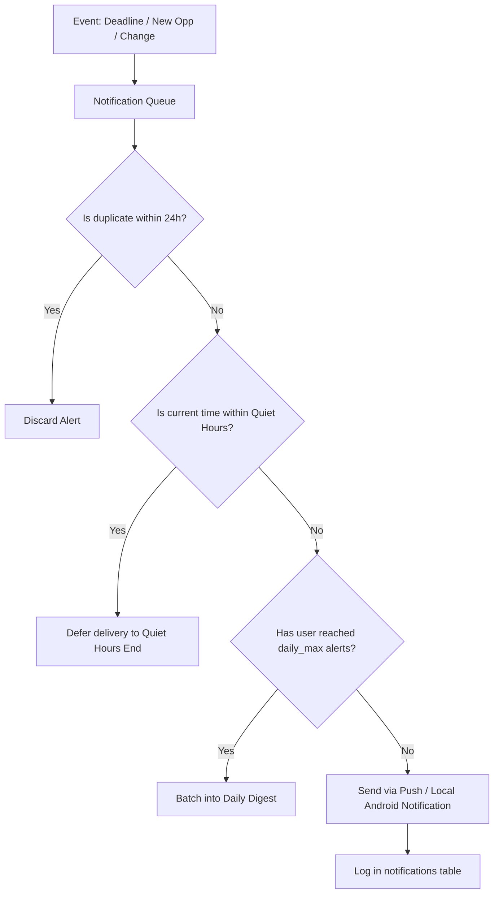

# GovAlert Notification & Anti-Spam Architecture

## 1. Notification Philosophy

Job aspirants and students are inundated with notification spam across multiple channels. GovAlert enforces a strict **High Signal, Zero Spam** philosophy:
- **Never repeat** identical alerts for unchanged opportunities.
- **Respect User Quiet Hours** (defaults: 22:00 to 07:00).
- **Daily Notification Cap** (configurable: default max 5 per day).
- **Granular Category Opt-Outs**.

---

## 2. Notification Triggers & Timings

### 1. New Personalized Opportunities
- Frequency: Batched digest, dispatched when high match score (>= 80%) opportunities are discovered.
- Example: *"3 new opportunities match your B.Tech Computer Science profile (including ISRO Scientist 'SC')."*

### 2. Deadline Reminders (User Opt-in & Saved Opportunities)
- Cadence:
  - 30 Days Before
  - 14 Days Before
  - 7 Days Before
  - 3 Days Before
  - 1 Day Before
  - On Deadline Day (Morning 08:00 AM)

### 3. Critical Changes & Corrigenda
- Triggered immediately upon re-ingestion diff detection:
  - Deadline extended (e.g. *"SSC JE Application Deadline extended to Oct 15, 2026"*).
  - Exam dates rescheduled or announced.
  - Vacancy counts revised.
  - Eligibility corrigendum issued.

---

## 3. Anti-Spam Dispatch Pipeline

