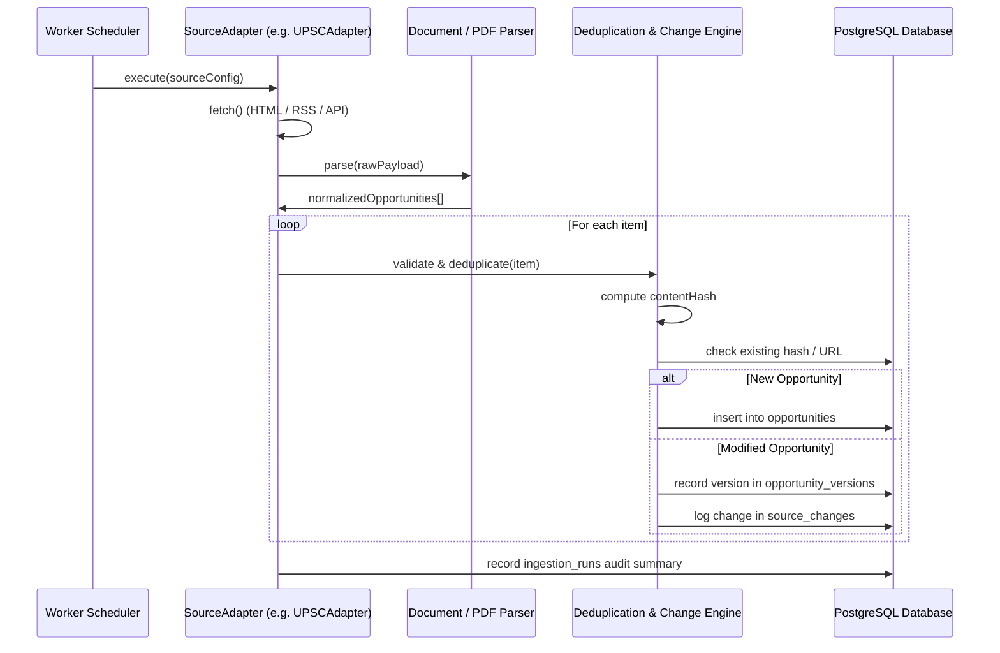

# GovAlert Source Adapters Architecture

## 1. Overview & Ethical Crawling Guidelines

GovAlert ingests public sector notifications only from verified, official domains (`.gov.in`, `.nic.in`, `.ac.in`, `.res.in`, etc.).
The architecture adheres to ethical standards:
1. **Respect `robots.txt`** and request rate limits.
2. **Never bypass CAPTCHAs** or attempt unauthorized access.
3. **Cache responses and use HTTP conditional headers (`If-Modified-Since`, `ETag`)** to minimize external server load.
4. **Transparent User-Agent**: Every request identifies GovAlert with contact info.

---

## 2. Adapter Lifecycle Architecture

Every adapter implements the `SourceAdapter` contract:

---

## 3. Adapters Included

### 1. `UPSCAdapter`
- Monitored source: Union Public Service Commission (`upsc.gov.in/examinations/active-examinations`)
- Output: Civil Services, Engineering Services, Combined Defense Services, National Defence Academy notices.
- Formats handled: HTML announcement tables and official PDF notices.

### 2. `SSCAdapter`
- Monitored source: Staff Selection Commission (`ssc.gov.in`)
- Output: CGL (Combined Graduate Level), CHSL (Combined Higher Secondary Level), JE (Junior Engineer), GD Constable notices & Corrigenda.
- Formats handled: Notice board JSON endpoints and PDF circulars.

### 3. `ScholarshipAdapter`
- Monitored source: National Scholarship Portal (`scholarships.gov.in`), AICTE Schemes (`aicte-india.org`)
- Output: Pre-matric, Post-matric, Pragati, Saksham, Swanath, Prime Minister's Scholarship Schemes.
- Formats handled: Scheme listing HTML and guidelines.

### 4. `GenericGovernmentAdapter`
- Reusable adapter for PSUs (ISRO, DRDO, BARC, BHEL, ONGC, NTPC) and State PSCs.
- Supports standardized RSS feeds and structured HTML tables with CSS/XPath selectors.
